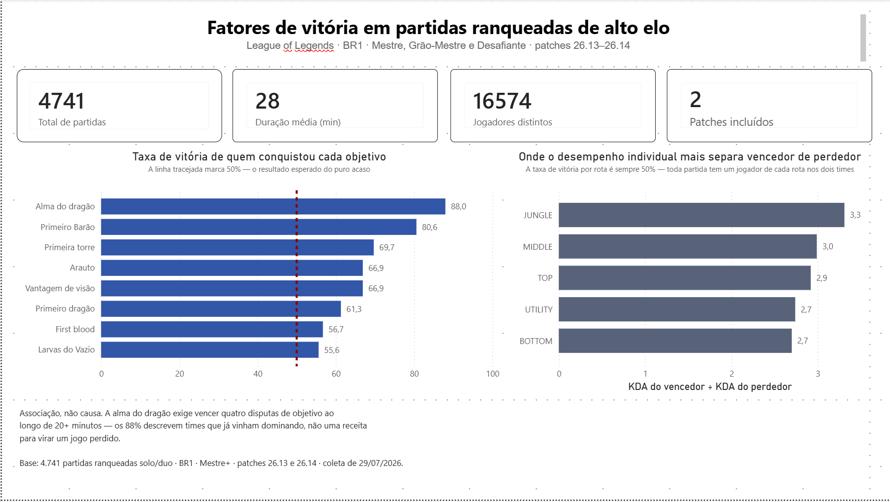
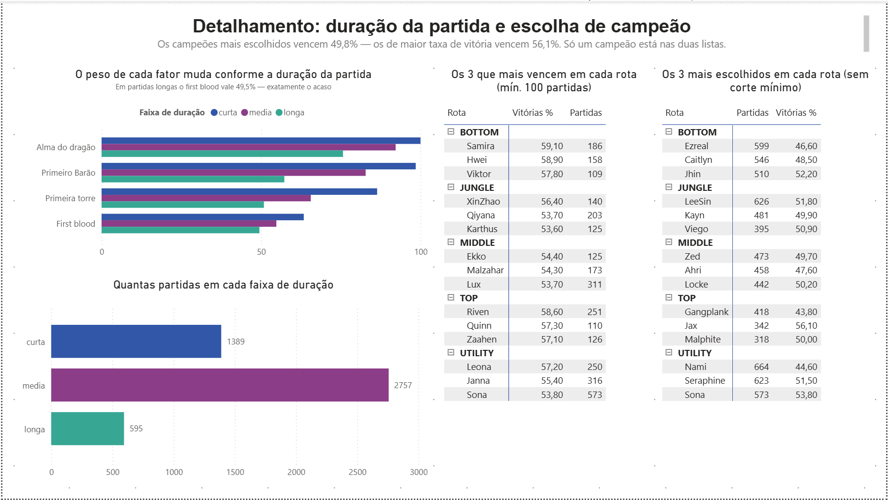

# Quais fatores decidem uma partida de League of Legends?

Análise de **4.741 partidas ranqueadas de alto elo** do servidor brasileiro, dos
patches 26.13 e 26.14, coletadas direto da API da Riot Games.

O objetivo é ordenar, com dados, os fatores mais associados à vitória — e separar
o que realmente pesa do que a comunidade *acha* que pesa.

**Stack:** Python · Pandas · PostgreSQL · Power BI

---

## O resultado principal

Taxa de vitória dos times que conquistaram cada objetivo:

| # | Fator | Vence | Times que conquistaram |
|---|---|---|---|
| 1 | **Alma do dragão** | **88,0%** | 1.230 |
| 2 | Primeiro Barão | 80,6% | 3.599 |
| 3 | Primeira torre | 69,7% | 4.693 |
| 4 | Arauto | 66,9% | 3.973 |
| 4 | Vantagem de visão | 66,9% | 4.659 |
| 6 | Primeiro dragão | 61,3% | 4.712 |
| 7 | First blood | 56,7% | 4.740 |
| 8 | Larvas do Vazio | 55,6% | 4.716 |

**Leia isto como associação, não como causa.** A alma do dragão exige vencer
quatro disputas de objetivo ao longo de 20+ minutos — os 88% descrevem times que
já vinham dominando a partida, não uma receita para virar um jogo perdido. A
discussão completa está em [Limitações](#limitações).



---

## Três achados que contrariam a intuição

### 1. Todo objetivo perde força conforme a partida se alonga

| Fator | Curta (<25 min) | Média (25–35) | Longa (>35) |
|---|---|---|---|
| Alma do dragão | **100,0%** (62) | 92,2% (822) | 75,7% (346) |
| Primeiro Barão | **98,5%** (473) | 82,8% (2.534) | 57,3% (592) |
| Primeira torre | 86,4% (1.341) | 65,6% (2.757) | 50,9% (595) |
| First blood | 63,4% (1.389) | 54,8% (2.757) | 49,5% (594) |

O first blood vale 56,7% no geral, mas **49,5% em partidas longas** — ou seja,
nada. Em jogo de 40 minutos, quem matou primeiro aos 3 minutos tem exatamente a
mesma chance que o adversário.

Os 100% da alma em partidas curtas não são um triunfo, são um alerta: a alma
exige quatro dragões, e o quarto raramente sai antes dos 25 minutos. Fechar isso
numa partida curta só acontece quando um time já está atropelando. **Taxa de
vitória de 100% quase nunca é descoberta — é sinal de que a variável está medindo
o resultado, não prevendo ele.**

### 2. Campeão popular não é campeão forte

| | Mais escolhidos | Maior taxa de vitória |
|---|---|---|
| Taxa de vitória média | **49,8%** | **56,1%** |
| Partidas (mediana) | 473 | 165 |

Os quinze campeões mais escolhidos vencem 49,8% em média — praticamente o acaso.
Os quinze de maior taxa de vitória vencem 56,1%, e são escolhidos cerca de três
vezes menos. **Só um campeão aparece nas duas listas: Sona.**

### 3. A intuição acerta a ordem e erra o tamanho

As hipóteses foram registradas **antes** de qualquer dado ser analisado.

| Fator | Previsto | Real | Erro |
|---|---|---|---|
| Primeiro Barão | 70–79% | 80,6% | subestimou |
| Primeira torre | 59–65% | 69,7% | subestimou |
| First blood | 51–55% | 56,7% | subestimou |
| **Visão** | **70–78%** | **66,9%** | **superestimou** |

A ordem prevista para o ranking errou uma única posição entre oito fatores. Já as
magnitudes erraram em todos os casos — e **em direções opostas conforme o tipo de
fator**: objetivos concretos (Barão, torre, first blood) foram subestimados nos
três casos; a vantagem difusa (visão) foi superestimada.

Hipótese para explicar: objetivos concretos são eventos pontuais e anunciados
pelo jogo, fáceis de lembrar e difíceis de dimensionar. Visão é o acúmulo
invisível de centenas de sentinelas, e o discurso da comunidade compensa isso
exagerando sua importância.



---

## Escopo

| Decisão | Escolha | Por quê |
|---|---|---|
| Região | BR1 | Servidor que conheço, meta que sei interpretar |
| Fila | Ranked Solo/Duo (420) | Flex tem muito jogo casual; Solo/Duo é jogado para ganhar |
| Elo | Mestre, Grão-Mestre, Desafiante | A API expõe esses três tiers diretamente; execução consistente faz a estratégia decidir, não o erro individual |
| Janela | Patches 26.13 e 26.14 | Coleta de 29/07/2026 |
| Volume | 5.000 partidas alvo → **4.741** após limpeza | Suficiente para médias estáveis, viável no limite da chave de desenvolvimento |
| Grão | 1 linha = 1 jogador em 1 partida | Permite agregar para time e partida sem perder detalhe |

**Fora do escopo por escolha:** builds e itemização, composições de time, picks e
bans do draft, pathing de jungler, séries temporais entre patches, outras filas.

---

## Como o projeto funciona

```
Riot API  →  data/raw/  →  data/processed/  →  data/final/  →  PostgreSQL  →  Power BI
             (JSON/JSONL)   (limpo)            (com atributos)   (3 tabelas)   (8 views)
```

Cada camada só lê da anterior e escreve na seguinte. **Nenhum script escreve na
pasta de onde leu** — isso torna qualquer etapa reexecutável sem corromper a
entrada, e foi adotado depois que uma versão anterior quebrou exatamente por
isso.

### 1. Coleta (`src/collect/`)

| Script | O que faz |
|---|---|
| `coleta_jogadores.py` | Busca os 9.861 jogadores dos três tiers e sorteia 600 sementes (semente fixa `42`) |
| `coleta_match_ids.py` | Puxa o histórico de cada semente e deduplica → 10.488 IDs únicos |
| `coleta_partidas.py` | Baixa o detalhe de 5.000 partidas em JSONL |

Amostrar 600 jogadores em vez dos 9.861 reduziu a coleta de ~16.400 chamadas
(5h30) para ~7.100 (2h25), sem perda relevante de cobertura — o pool de alto elo
do BR1 é pequeno e as partidas se repetem entre históricos.

Os três scripts são **retomáveis**: relêem o que já foi salvo e continuam de onde
pararam. A chave de desenvolvimento da Riot expira em 24h, então uma coleta de
duas horas precisa sobreviver à troca de chave. Ao receber `403`, o script salva
o progresso e encerra com mensagem em vez de falhar silenciosamente.

O formato **JSONL** (um objeto por linha, escrito por acréscimo) foi escolhido
para que uma queda no meio da coleta custe no máximo uma partida.

### 2. Transformação (`src/transform/`)

`transformar.py` gera três tabelas em grãos diferentes a partir do JSON bruto:

| Tabela | Grão | Linhas |
|---|---|---|
| `partidas` | 1 linha = 1 partida | 4.741 |
| `times` | 1 linha = 1 time em 1 partida | 9.482 |
| `jogadores` | 1 linha = 1 jogador em 1 partida | 47.410 |

**Regras de limpeza aplicadas** (detalhadas em [`docs/ETAPA-04`](docs/ETAPA-04-dicionario-de-dados.md)):

- **D1** — descartar remakes (partidas com menos de 5 minutos)
- **D2** — descartar partidas fora de Solo/Duo
- **D3** — ignorar o campo `atakhan`, verificado como sempre zerado em 5.000 partidas
- **D4** — descartar partidas com jogador sem posição atribuída

D1 já resolvia 11 dos 13 casos de D4 — as regras de limpeza não são independentes,
e a ordem em que se aplicam muda quantas linhas cada uma remove.

O script termina com **10 asserções** que falham a execução se a estrutura sair
errada: contagem de linhas, taxa de vitória exatamente 50%, dois times por
partida, dez jogadores por partida, nenhuma chave órfã.

`atributos.py` deriva as métricas que não vêm prontas da API:

| Atributo | Fórmula | Por quê |
|---|---|---|
| `duracao_minutos` | `duracao_segundos / 60` | Legibilidade |
| `faixa_duracao` | curta <25 · média 25–35 · longa >35 | Permite ver o efeito da duração |
| `alma_do_dragao` | `dragoes_abatidos >= 4` | A API não traz o campo pronto |
| `kda` | `(kills + assists) / max(deaths, 1)` | O `max` evita divisão por zero |
| `cs_por_minuto`, `ouro_por_minuto` | total ÷ duração | Totais brutos são contaminados pela duração da partida |

### 3. Modelagem e carga (`sql/01_criar_tabelas.sql`, `src/load/`)

O esquema não confia no Python. As regras que o pipeline verifica com `assert`
estão **também** no banco como restrições:

```sql
CONSTRAINT chk_alma_coerente CHECK (alma_do_dragao = (dragoes_abatidos >= 4))
CONSTRAINT chk_cs_total      CHECK (cs_total = cs_minion + cs_jungle)
CONSTRAINT chk_rota          CHECK (rota IN ('TOP','JUNGLE','MIDDLE','BOTTOM','UTILITY'))
```

A diferença importa: `assert` verifica **depois** de o dado existir; `CONSTRAINT`
**impede** o dado errado de entrar. Uma restrição no banco protege contra
qualquer caminho de escrita, inclusive um `INSERT` manual daqui a um ano.

As chaves estrangeiras são compostas (`id_partida, team_id`) porque `team_id`
sozinho não identifica um time — o valor `100` se repete em todas as partidas.

`carregar_banco.py` é **idempotente**: dá `TRUNCATE ... CASCADE` antes de
inserir, então pode rodar quantas vezes for preciso sem duplicar. Ao final,
reconcilia uma métrica conhecida (a taxa de 80,6% do primeiro Barão) para
confirmar que o dado atravessou o Pandas e chegou íntegro ao PostgreSQL.

> Nunca use `to_sql(if_exists="replace")`: ele derruba a tabela e leva junto
> todas as restrições e índices.

### 4. Consultas e dashboard (`sql/`, `powerbi/`)

- [`02_perguntas_de_negocio.sql`](sql/02_perguntas_de_negocio.sql) — uma query por pergunta
- [`03_views_dashboard.sql`](sql/03_views_dashboard.sql) — 8 views que alimentam o Power BI

O Power BI consome **views**, não tabelas. Toda a lógica de agregação fica no
banco, onde é versionável, auditável e legível por qualquer pessoa que saiba SQL
— em vez de escondida em medidas DAX dentro de um arquivo binário.

---

## Como reproduzir

**Pré-requisitos:** Python 3.10+, PostgreSQL 16+, chave de desenvolvimento da
[Riot Games](https://developer.riotgames.com) e Power BI Desktop (opcional).

```bash
git clone https://github.com/AlexandreAkyra/projeto-lol
cd projeto-lol

python -m venv venv
venv\Scripts\activate          # Windows
pip install -r requirements.txt

copy .env.example .env         # e preencha com suas credenciais
```

Crie o banco `lol_analytics` no PostgreSQL e rode, nesta ordem:

```bash
# Coleta — ~2h30 no total, retomável
python src/collect/coleta_jogadores.py
python src/collect/coleta_match_ids.py
python src/collect/coleta_partidas.py

# Transformação — poucos minutos
python src/transform/transformar.py
python src/transform/atributos.py
```

No pgAdmin, execute `sql/01_criar_tabelas.sql`. Então:

```bash
python src/load/carregar_banco.py
```

Por fim, `sql/03_views_dashboard.sql` cria as views, e
`powerbi/dashboard_lol.pbix` abre conectado a elas.

> **A coleta não é determinística no tempo.** As sementes são sorteadas com
> `random.seed(42)`, mas o histórico de partidas de cada jogador muda a cada dia.
> Reproduzir hoje devolve partidas diferentes das de 29/07/2026 — o *método* é
> reprodutível, o *conjunto exato* não.

---

## Limitações

**L1 — Associação, não causalidade.** Os dados são observacionais: as partidas
aconteceram, não houve experimento. Quando um fator aparece associado à vitória,
não se pode afirmar que ele a *causa*.

O caso da visão é o mais explícito: time que está ganhando morre menos, controla
mais mapa e por isso coloca mais sentinelas. Parte dos 66,9% é a vitória causando
a visão, não o contrário.

**L2 — Recorte de elo.** Apenas Mestre+, uma fração mínima e atípica da base. Não
se pode afirmar que os fatores valham para elos baixos, onde a variância de erro
individual pode sobrepor qualquer fator estratégico.

**L3 — Recorte de região.** Só BR1. Os resultados carregam as particularidades do
meta brasileiro.

**L4 — Viés de atividade.** As partidas vêm do histórico de jogadores ativos, e
quem joga mais contribui com mais partidas.

**L5 — O elo é uma foto do dia da coleta.** O tier foi lido em 29/07, mas as
partidas são de até 30 dias antes. Partidas jogadas ainda em Diamante aparecem
rotuladas como Mestre.

**L6 — As observações não são independentes.** Os 600 jogadores semente são 3,6%
dos jogadores da amostra, mas aparecem em 13,3% das linhas — sobre-representação
de cerca de 3,8x, inerente ao método de coleta por histórico.

### Sobre a análise de campeões

**A ordem dentro de cada top 3 não é significativa.** Com 100 a 250 partidas, a
margem de erro de uma proporção fica em torno de ±7 a ±10 pontos percentuais.
Samira (59,1%) e Hwei (58,9%) estão separados por 0,2 ponto — isso é ruído. O que
os dados sustentam é que esses campeões estão **acima de 50%**, não a ordem entre
eles.

O corte de **100 partidas** existe porque taxa sem base engana: 80% de vitória em
30 partidas tem margem de ±14 pontos, o valor real podendo estar entre 66% e 94%.
Entre 25 e 39 campeões por rota passaram no corte, então o ranking teve pool de
sobra.

---

## Perguntas que ficaram sem resposta

**Ouro aos 15 minutos** exige o endpoint de *timeline* da Riot, que dobraria o
custo de coleta. Foi planejado e não executado.

**Farm versus abates** exige agregar jogadores por time excluindo o suporte
(cuja média de CS não é comparável) e normalizar duas métricas em escalas
diferentes.

**"Qual rota vence mais?"** é estruturalmente impossível: toda partida tem um
jogador de cada rota nos dois times, então a taxa de vitória de qualquer rota é
exatamente 50%. Sempre. Não é limitação da amostra, é aritmética.

A pergunta foi reformulada para *em qual rota o desempenho individual mais separa
quem venceu de quem perdeu*:

| Rota | KDA vencedor ÷ KDA perdedor |
|---|---|
| **JUNGLE** | **3,32x** |
| MIDDLE | 2,99x |
| TOP | 2,92x |
| UTILITY | 2,74x |
| BOTTOM | 2,70x |

Com uma ressalva grande: vencer *produz* KDA. Time que ganha mata mais e morre
menos por definição, e nenhuma rota fica abaixo de 2,7x. O que é interpretável é
a **comparação relativa entre rotas**, já que o viés afeta as cinco igualmente.

---

## Trabalho futuro

| Limitação | Como mitigar |
|---|---|
| **L1 — causalidade** | Restringir a análise a partidas equilibradas no momento do objetivo (diferença de ouro abaixo de 500 aos 10 min). Se o efeito some, era sintoma; se resiste, é candidato a causa. Com a *timeline* dá para checar também a ordem temporal. |
| **L2 — elo** | Repetir a análise em Prata e Esmeralda. Fatores que se mantêm em todos os elos são propriedades do jogo; os que invertem são propriedades do nível de habilidade. |
| **L3 — região** | Replicar em KR e EUW. O script já é parametrizado por região no `.env` — custo baixo. |
| **L4 e L6 — dependência** | Impor teto de partidas por jogador (ex.: 15) e sempre reportar jogadores distintos ao lado de partidas. |
| **L5 — snapshot de elo** | Encurtar a janela para 7–14 dias, e coletar snapshots periódicos para construir histórico de elo — que a API não fornece retroativamente. |

---

## Estrutura do repositório

```
projeto-lol/
├── src/
│   ├── collect/       # coleta da API (3 scripts, retomáveis)
│   ├── transform/     # limpeza, grãos e atributos derivados
│   └── load/          # carga idempotente no PostgreSQL
├── sql/
│   ├── 01_criar_tabelas.sql        # DDL com restrições
│   ├── 02_perguntas_de_negocio.sql # uma query por pergunta
│   └── 03_views_dashboard.sql      # 8 views para o Power BI
├── docs/              # charter, perguntas, dicionário de dados, resultados
├── notebooks/         # exploração
├── exploracao/        # scripts de teste da API (fora do pipeline)
├── powerbi/           # .pbix e capturas do dashboard
└── data/              # não versionado — regenerável rodando o pipeline
```

**Documentos:**

- [Charter e limitações](docs/ETAPA-01-planejamento.md)
- [Perguntas de negócio e hipóteses](docs/ETAPA-02-perguntas-de-negocio.md)
- [Coleta na API da Riot](docs/ETAPA-03-coleta.md)
- [Dicionário de dados e regras de limpeza](docs/ETAPA-04-dicionario-de-dados.md)
- [Resultados completos](docs/ETAPA-09-resultados.md)
- [Guia de montagem do dashboard](docs/ETAPA-10-dashboard.md)

---

**Dados:** Riot Games API · **Base:** 4.741 partidas ranqueadas solo/duo · BR1 ·
Mestre, Grão-Mestre e Desafiante · patches 26.13 e 26.14 · coleta de 29/07/2026.

Este projeto não é endossado pela Riot Games e não reflete suas opiniões.
League of Legends © Riot Games, Inc.
